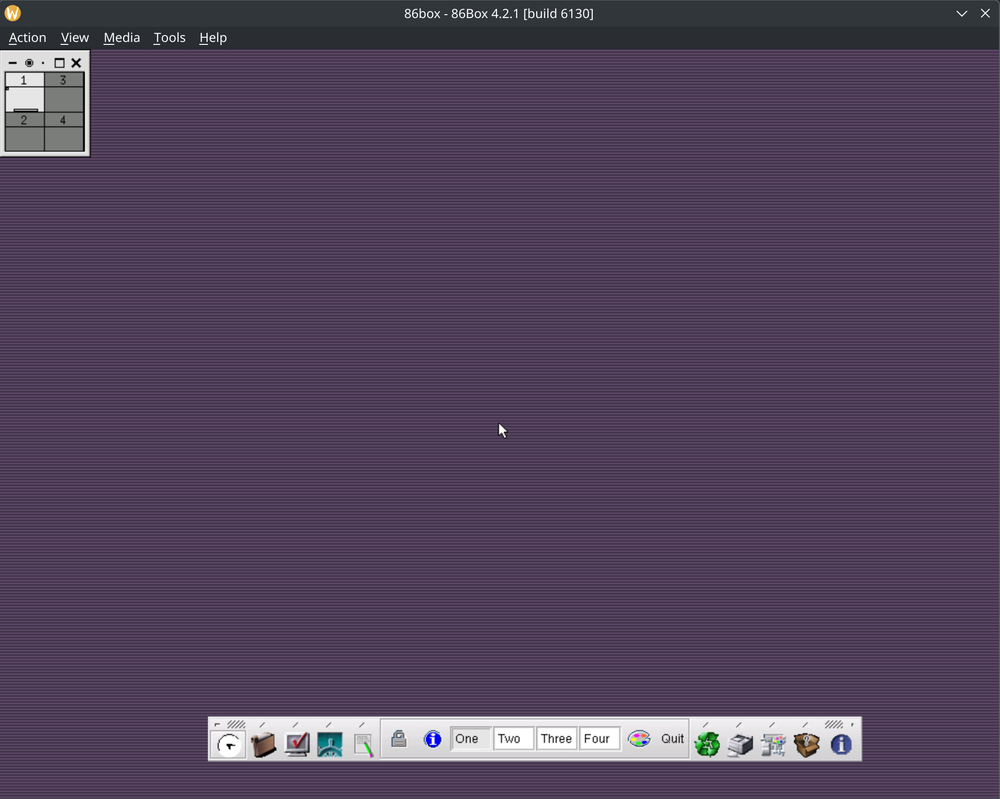

# How to try Xfce in 86Box
## Step 1. Download 86Box
Go to https://github.com/86Box/86Box and download. I use appImage version.

### Step 2. Unarchive hdd images
```shell
cd 86box
xz --decompress hda.vhd.xz
xz --decompress xfce.img.xz
```

### Step 3. Start VM
Start VM. 
OS: Slackware 7.1
Login: `patrick`, Password: `patrick`. Root password: `patrick`

```shell
cd 86box
./86box
```
After start hdd `xfce.img` must be mount to path `/mnt`.

### Step 4. Compile and try to run some old staff
Create dir (optional).
```shell
mkdir /xfce
chmod 777 /xfce
```
Compile Xfce
```shell
export XFCE="3.8.5"
# compile
cd /mnt
gzip -d xfce-${XFCE}.tar.gz
tar xvf xfce-${XFCE}.tar
rm xfce-${XFCE}.tar
cd xfce-${XFCE}
./configure --prefix=/xfce/${XFCE}/ --datadir=/xfce/${XFCE}/share --sysconfdir=/xfce/${XFCE}/etc --disable-dt
make && make install-strip && make clean
```
Prepare vars
```shell
# setup
$ export XFCE="3.1.2" && \
  rm -fr ~/.xf* && /xfce/${XFCE}/bin/xfce_setup && \
  echo "XFCE=$XFCE" > ~/.xfcever && \
  cp ~/.xinitrc.bak ~/.xinitrc && \
  startx
#XFCE_LOCALE_DIR="/xfce/3.1.2/share/XFCE/locale"
```
Open .xinitrc
```shell
# xinitrc
export TERM=xterm
vi ~/.xinitrc
```
Insert some peace of code...
```shell
if [ "x$XFCE" = "x" ]
then
	XFCE=$XFCE
else
	if [ -f $HOME/.xfcever ]; then
		source $HOME/.xfcever
	fi
fi

export PATH=/xfce/${XFCE}/bin:$PATH
if [ -d /xfce/${XFCE}/share/XFCE ]; then
	XFCE_DATA=/xfce/${XFCE}/share/XFCE
else
	XFCE_DATA=/xfce/${XFCE}/share/xfce
fi

exec xfwm
```
... and try to start X11
```shell
startx
```

